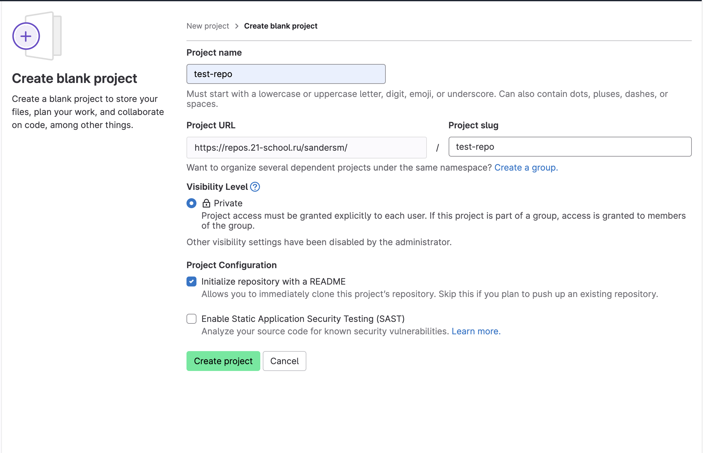
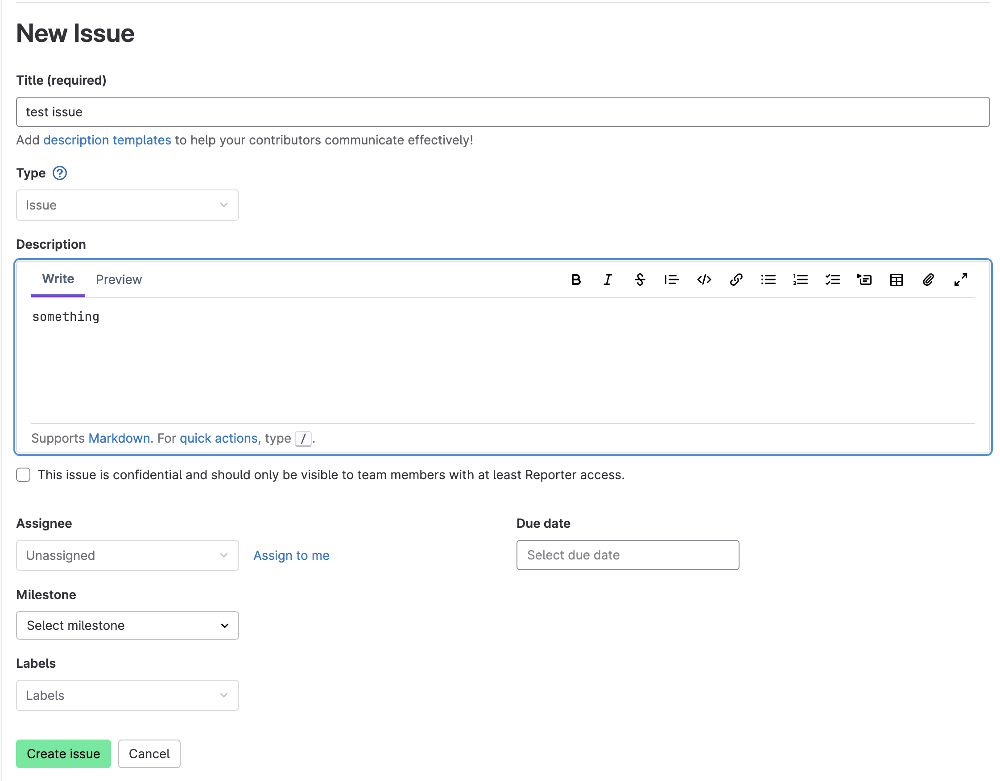

# GitLab short manual

## 1. Создание личного репозитория с `.gitignore` и `README.md`

1. Зайдите на GitLab и войдите в свой аккаунт.
2. Нажмите на плюсик в шапке сайта.
3. В появившемся меню нажать на **New project/repository**.
4. Выберите **Create blank project**
5. В поле **Project name** задайте имя репозитория
6. Обязательно проверьте что флажок на пункте **Initialize repository with a README** поставлен
7. Нажмите **Create project** и проект будет создан
8. Далее необходимо возле копки **master ᨆ** и текста с названием репозитория, нажать на кнопку плюсика и в появившемся окне нажать **New file**
9. Возле текста **master /** введите имя файла `.gitignore`
10. Рядом появляется кнопка, нажимаем на нее и выбираем нужный шаблон игнорируемых файлов.

## 2. Создание веток `develop` и `master`

1. Перейдите в ваш репозиторий на GitLab.
2. Откройте вкладку "Repository" и выберите "Branches".
3. В поле "New branch" введите "develop" и нажмите "Create branch".

## 3. Установка ветки `develop` по умолчанию

1. Перейдите в настройки репозитория, нажав на "Settings" -> "Repository".
2. В разделе "Branch defaults" выберите "develop".
3. Нажмите "Save changes".

## 4. Создание issue на создание текущего мануала

1. Перейдите во вкладку "Issues" и нажмите "New issue".
2. Введите заголовок, например "Создание мануала".
3. В поле "Description" напишите подробности задачи.
4. Нажмите "Create issue".

## 5. Создание ветки по issue

1. Откройте созданный issue.
2. Нажмите на стрелочку возле "Create merge request".
3. Введите "Branch name", например, "manual".
4. В пункте "Source (branch or tag)" введите ветку куда хотите влить изменения.